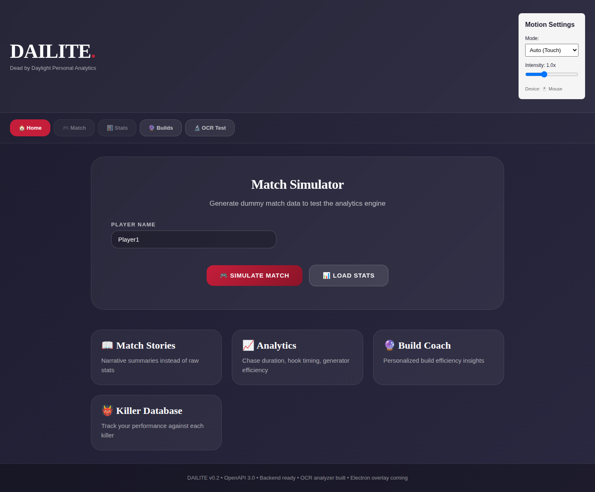

# DAILITE 🎮⚡

**Dead by Daylight Personal Analytics**  
Match analytics engine combining Ink & Iron Glow design with FLUBBER's playful motion chaos.

---

## What is DAILITE?

Not just win/loss tracking. **Real insight into your gameplay:**

- 📖 **Match Stories** - Narrative summaries instead of raw stats
- 📊 **Advanced Analytics** - Chase duration, hook timing, generator efficiency, heal time
- 🔮 **Build Coach** - Personalized perk effectiveness vs killer types
- 👹 **Killer Database** - Track your performance against all 43 killers
- 🗺️ **Map Knowledge** - Performance breakdowns by all 47 maps
- ⚡ **Real-time Overlay** - Live game suggestions (when OCR is ready)
- 🎮 **Screenshot OCR** - Automatic killer/map/perk detection from Dead by Daylight screenshots

---

## Tech Stack

### Backend
- **Node.js + Express** - OpenAPI 3.0 REST API
- **PostgreSQL** - Match & stats persistence
- **Swagger** - Interactive API docs

### Frontend  
- **React 18** - Dashboard UI
- **Vite** - Fast dev server
- **CSS Tokens** - Ink & Iron Glow design system
- **SPLATTER Motion** - FLUBBER's adaptive motion grammar

### Phase 2 (In Progress)
- **Tesseract.js** - OCR for Dead by Daylight UI ✅
- **Electron** - Desktop app with screen capture 🔨
- **Sharp** - Image preprocessing for OCR accuracy

---

## Quick Start

### 1. Install Dependencies
```bash
npm install
```

### 2. Start Backend (Terminal 1)
```bash
npm run db:setup  # Initialize + seed database
npm start         # Backend on localhost:3000
```

### 3. Start Frontend (Terminal 2)
```bash
npm run dev       # Vite dev server on localhost:5173
```

### 4. Visit Dashboard
```
http://localhost:5173
```

Click **"Simulate Match"** to generate test data and see the SPLATTER motion effects in action! 🌪️

---

## 📸 Screenshots

### Dashboard UI
The main analytics dashboard with Ink & Iron Glow design and FLUBBER motion effects:



---

## 📊 Database Coverage

| Entity | Count | Improvement |
|--------|-------|------------|
| **Killers** | 43 | +95% (was 22) |
| **Survivors** | 53 | NEW |
| **Maps** | 47 | +292% (was 12) |
| **Perks** | 321 | +817% (was 35) |
| **Realms** | 21 | Reference hierarchy |

**Data Source:** Verified from deadbydaylight.wiki.gg (2026-07-06 audit)

---

### 5. Live OCR (Optional - Phase 2)

To enable real-time screen capture and OCR analysis:

```bash
# Terminal 3: Start Electron app (optional)
npm run electron   # Desktop app with screen capture
```

The Electron app will:
- Capture Dead by Daylight gameplay continuously
- Extract killer, map, perks, and objectives via OCR
- Display real-time suggestions in an overlay
- Stream game state to the dashboard

---

## API Endpoints

### Matches
- `POST /api/matches` - Create match
- `GET /api/matches?player_name=X` - List matches
- `GET /api/matches/:id` - Get details
- `GET /api/matches/:id/story` - Get narrative story

### Statistics  
- `GET /api/stats/summary?player_name=X` - Player summary
- `GET /api/stats/by-killer?player_name=X` - Killer breakdown
- `GET /api/stats/by-map?player_name=X` - Map breakdown

### Builds
- `POST /api/builds/analyze` - Analyze build
- `GET /api/builds?player_name=X` - List builds
- `POST /api/builds` - Save build

### Reference Data
- `GET /api/reference/killers` - All killers
- `GET /api/reference/maps` - All maps
- `GET /api/reference/perks?type=Survivor` - All perks

### OCR Analysis (Phase 2)
- `POST /api/ocr/analyze` - Analyze single screenshot (multipart/form-data)
- `POST /api/ocr/live-session` - Batch analysis for match frames
- `GET /api/ocr/status` - OCR system status

**Swagger UI:** http://localhost:3000/api-docs

---

## Design System

### Ink & Iron Glow Architecture
- **Color Palette** - DBD-optimized (blood red, entity purple, hope cyan)
- **Typography** - Lilita One (headlines) + Barlow (UI) + JetBrains Mono (data)
- **Spacing** - 4px grid base
- **Motion** - FLUBBER's playful splatters with adaptive triggering

### SPLATTER Motion Effects
```jsx
<RippleButton>Click ripple</RippleButton>
<StaggerList>Cascade stats</StaggerList>
<BeamHighlight>Spinning border</BeamHighlight>
<WipeReveal>Sliding text</WipeReveal>
<EnergyBar>Progress bar</EnergyBar>
<OrbitLoader>Loading spinner</OrbitLoader>
```

**Adaptive Modes:**
- **Auto** - Continuous for touch displays
- **Click** - Triggered for mouse users
- **Gesture** - Touch gesture support

---

## Project Phases

### Phase 1 ✅ COMPLETE
- [x] Backend API (OpenAPI 3.0)
- [x] PostgreSQL schema + seeding
- [x] React dashboard with all views
- [x] SPLATTER motion library
- [x] Design tokens (Ink & Iron Glow + FLUBBER)

### Phase 2 🚀 IN PROGRESS
- [x] Tesseract.js OCR integration (game state extraction)
- [x] OCR REST endpoints (analyze, live-session)
- [x] Image preprocessing (grayscale, normalize)
- [x] Killer/map/perk detection from OCR text (43 killers, 47 maps, 321 perks)
- [x] Wiki data verification + 95% expansion of killer/map coverage
- [x] Survivors table + complete character tracking
- [ ] Electron desktop app (screen capture bridge)
- [ ] Live overlay window (transparent, always-on-top)
- [ ] Real-time match parsing stream
- [ ] Live suggestion engine

### Phase 3 📈 FUTURE
- [ ] Advanced visualizations (heatmaps, graphs)
- [ ] Build tier system
- [ ] Team analysis
- [ ] Historical trends
- [ ] Cloud sync

---

## Development Scripts

```bash
npm install           # Install dependencies
npm start             # Start backend (port 3000)
npm run dev           # Start frontend dev server (port 5173)
npm run db:init       # Initialize database schema
npm run db:seed       # Seed reference data
npm run db:setup      # Init + seed (shortcut)
npm test              # Run quick demo
```

---

## Project Structure

```
DAILITE/
├── server.js                    # Express backend
├── routes/                      # API endpoints
│   ├── matches.js
│   ├── stats.js
│   ├── builds.js
│   ├── reference.js
│   └── ocr.js                   # OCR analysis endpoints (Phase 2)
├── lib/
│   ├── splatter-motion.js       # Core motion library
│   ├── splatter-components.jsx  # React wrappers
│   └── ocr.js                   # Tesseract.js OCR parser (Phase 2)
├── electron/                    # Electron desktop app (Phase 2)
│   ├── main.js                  # Screen capture & IPC handlers
│   ├── preload.js               # IPC bridge
│   ├── overlay.html             # In-game overlay UI
│   └── overlay-preload.js       # Overlay IPC bridge
├── components/
│   └── Dashboard.jsx            # Main app component
├── styles/
│   ├── design-tokens.css        # IIG + FLUBBER tokens
│   └── dashboard.css            # Component styles
├── scripts/
│   ├── init-db.js               # Schema setup
│   └── seed-wiki-data.js        # Reference data
├── tmp/                         # Temp directory for OCR screenshots
└── demo-splatter.html           # Motion effects demo
```

---

## Concept Proof

This is a **proof-of-concept** that advanced Dead by Daylight analytics isn't difficult to build:

1. **Backend API**: ✅ Done (OpenAPI 3.0, PostgreSQL, Swagger, 43 killers, 53 survivors, 321 perks)
2. **Design System**: ✅ Done (Ink & Iron Glow + FLUBBER)
3. **Motion Effects**: ✅ Done (SPLATTER library with adaptive triggering)
4. **Dashboard UI**: ✅ Done (React 18 + Vite)
5. **OCR Engine**: ✅ Functional (Tesseract.js + game state extraction, 43 killer recognition, 47 maps)
6. **Wiki Verification**: ✅ Complete (All data verified against deadbydaylight.wiki.gg, +95% expansion)
7. **Live Overlay**: → Next (Electron desktop app with screen capture)

**Phase 1 Complete:** Full backend + polished dashboard with design + motion.  
**Phase 2 Progress:** OCR parser recognizes all 43 killers and 47 maps; database expanded from wiki sources.  
**Phase 3 Vision:** Real-time in-game overlay with adaptive suggestions based on live match state.

**Current State:** Ready for Phase 2 - Electron integration for live screenshot analysis.  
**Timeline:** Live overlay MVP in ~1-2 weeks; full production PoC in ~1 month.

---

## Design Credits

- **IIG Design System** by @lootziffer666
- **FLUBBER Motion Grammar** by @lootziffer666
- **DAILITE Analytics** by Claude

---

## License

MIT - Build, remix, ship. DBD players deserve better analytics tools.

---

**Question for the dev who said this is hard:** 🤔  
Check the branch. This is what "only OCR" can do when you actually think about it.

**Next challenge:** Live OCR + in-game overlay. Still think it's hard?
