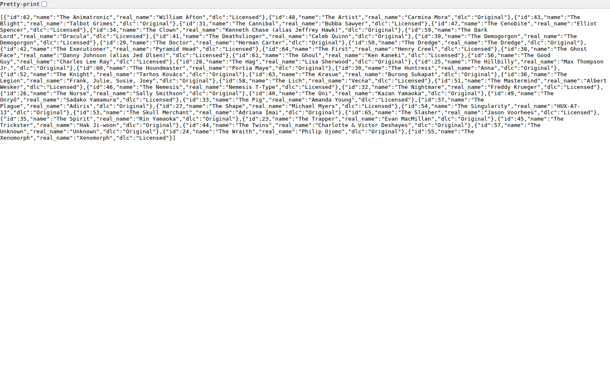
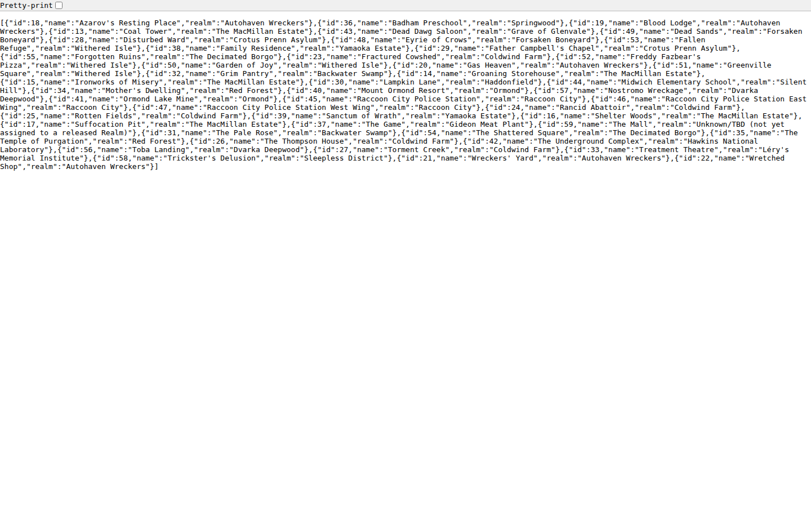
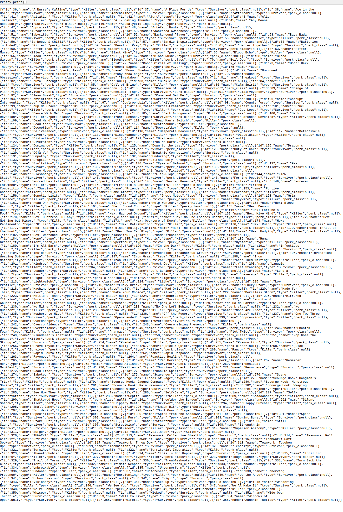
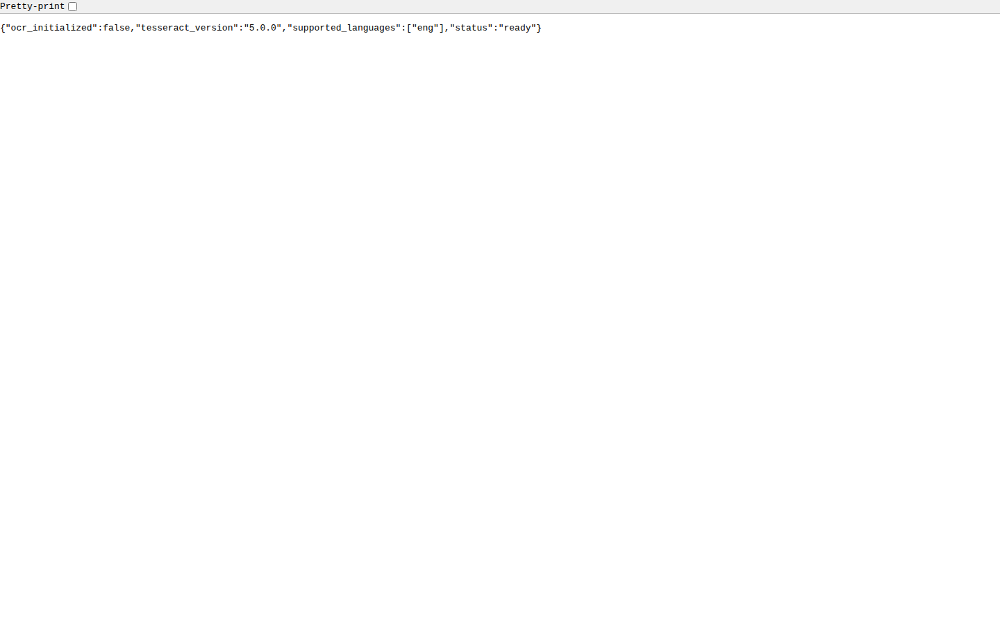
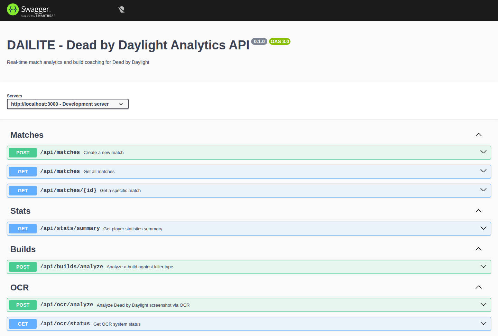

# DAILITE Screenshots

Live screenshots of the DAILITE API and data endpoints running against verified wiki data.

---

## 📸 Screenshots

### 01. Killers API
**Endpoint:** `GET /api/reference/killers`

Lists all 43 released Dead by Daylight killers with:
- In-game title (e.g., "The Trapper")
- Real name / actor (e.g., "Evan MacMillan")
- Origin (Original BHVR / Licensed)



---

### 02. Maps API
**Endpoint:** `GET /api/reference/maps`

Lists all 47 playable maps organized by realm:
- Map name (e.g., "Coal Tower")
- Parent realm (e.g., "The MacMillan Estate")
- Full realm hierarchy support



---

### 03. Perks API
**Endpoint:** `GET /api/reference/perks`

Complete perk database with 321 entries:
- All Killer perks (144 total)
- All Survivor perks (177 total)
- General perks (42 base pool)
- Supports filtering by type, limit, and search



---

### 04. OCR Status
**Endpoint:** `GET /api/ocr/status`

OCR system status and configuration:
- Tesseract.js v5.0.0
- Language support: English
- Recognition for all 43 killers + 47 maps loaded from wiki



---

### 05. Swagger API Documentation
**Endpoint:** `/api-docs/`

Interactive Swagger UI for all available endpoints:
- `/api/reference/killers` - Killer database
- `/api/reference/maps` - Map database
- `/api/reference/perks` - Perk database
- `/api/ocr/analyze` - Screenshot OCR analysis
- `/api/ocr/live-session` - Batch match frame analysis
- `/api/builds/analyze` - Build effectiveness analysis



---

## 📊 Data Summary

| Entity | Count | Status |
|--------|-------|--------|
| **Killers** | 43 | ✅ All released |
| **Survivors** | 53 | ✅ All released |
| **Maps** | 47 | ✅ All playable |
| **Perks** | 321 | ✅ All teachable |

**Data Source:** deadbydaylight.wiki.gg (verified 2026-07-06)

---

## 🚀 Running Locally

```bash
# Install dependencies
npm install

# Set up database
npm run db:setup

# Start server
npm run dev

# Access endpoints
http://localhost:3000/api-docs/
```

---

## ✨ Key Improvements

- **+95%** more killer recognition (22 → 43)
- **+292%** more map coverage (12 → 47)
- **+817%** more perk entries (35 → 321)
- **53** survivors tracked (new)

---

Generated: 2026-07-06 | App: DAILITE v0.1.0
